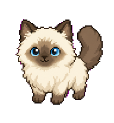

# Codex Ragdoll Pet

A custom Ragdoll cat pet for the Codex desktop app.



## Install

Run:

```sh
./scripts/install.sh
```

Then open Codex settings and select `Ragdoll Cat` from the pet/avatar picker.

The pet files are installed to:

```text
~/.codex/pets/ragdoll-cat/
```

## Files

- `pet/ragdoll-cat/pet.json`: pet metadata
- `pet/ragdoll-cat/spritesheet.png`: 1536 x 1872 Codex pet spritesheet
- `assets/ragdoll-preview.png`: preview image

## Notes

This repository only contains the shareable pet package and installer. It does not include local Codex state, logs, API keys, or generation response files.
