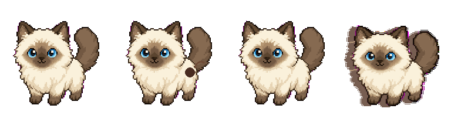

# Codex Ragdoll Pet

A custom animated Ragdoll cat pet for the Codex desktop app, with an asymmetric reference-style face and extra motion states.


## Motion Preview



## Install

Run:

```sh
./scripts/install.sh
```

Then open Codex settings and select `Ragdoll Cat` from the pet/avatar picker.

The pet files are installed to:

```text
~/.codex/pets/ragdoll-cat/
```

## Files

- `pet/ragdoll-cat/pet.json`: pet metadata
- `pet/ragdoll-cat/spritesheet.png`: 1536 x 1872 Codex pet spritesheet
- `assets/ragdoll-preview.png`: preview image
- `assets/previews/ragdoll-motion-preview.gif`: compact animation preview
- `scripts/generate_animated_ragdoll_spritesheet.py`: rebuilds the animated spritesheet from the preview asset, including the asymmetric face markings
- `scripts/check_spritesheet_motion.py`: verifies that the spritesheet has non-static frame motion

## Notes

This repository only contains the shareable pet package and installer. It does not include local Codex state, logs, API keys, or generation response files.
